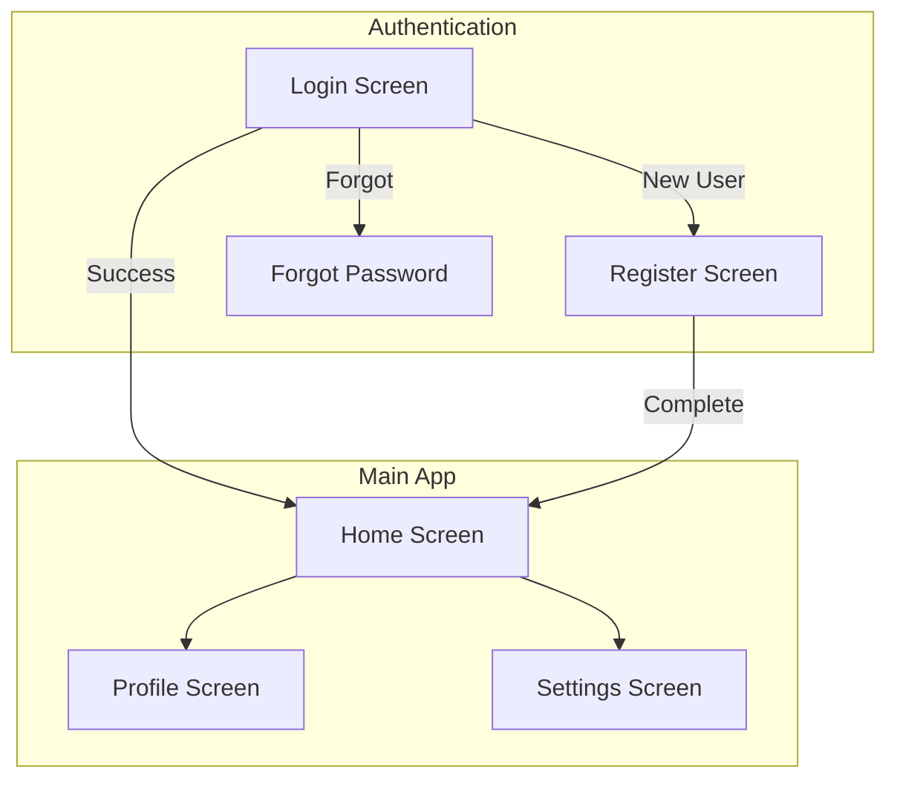
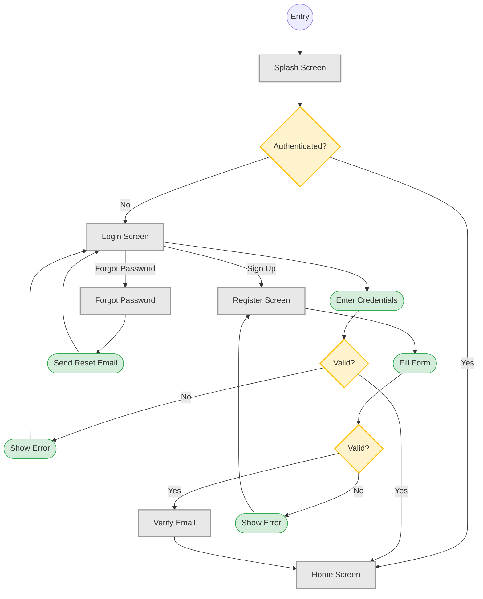
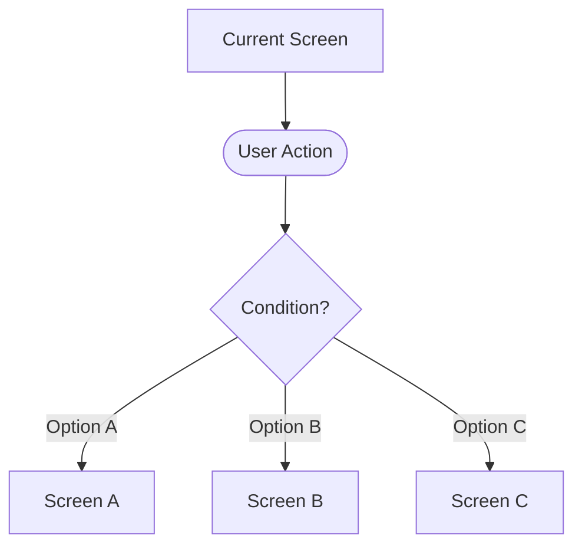
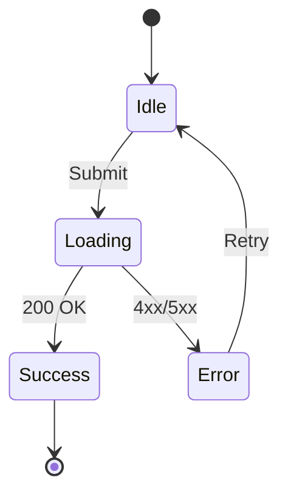
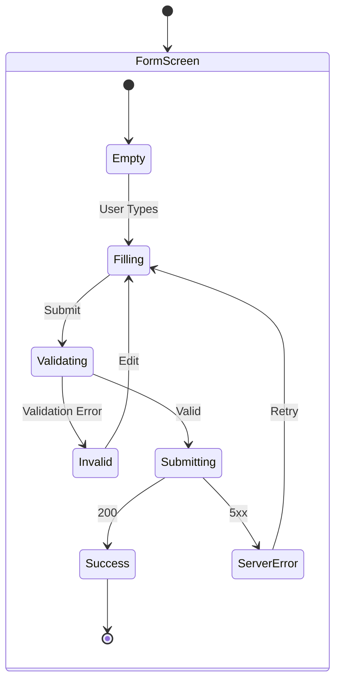
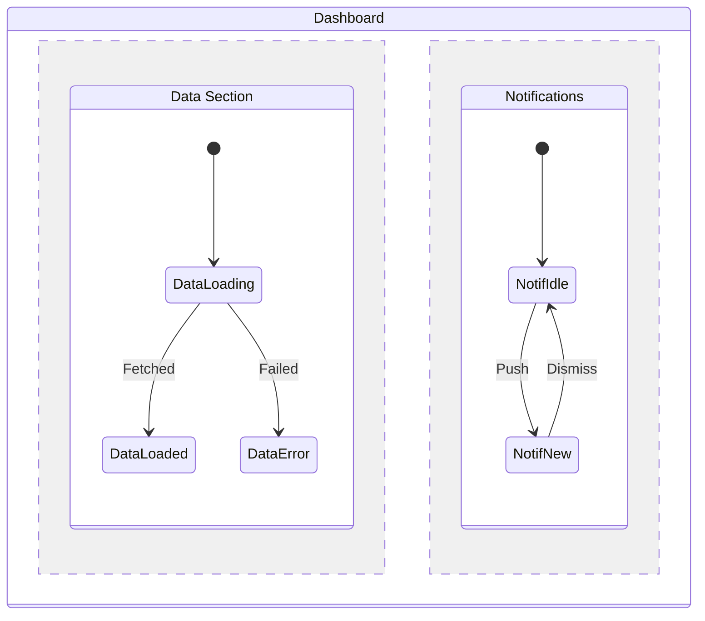
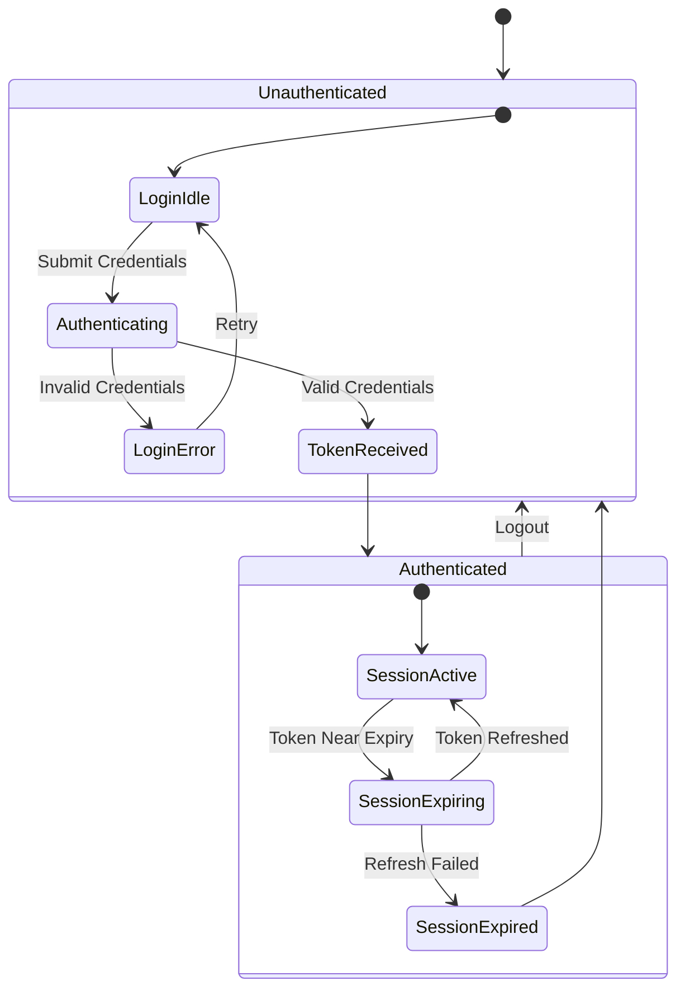
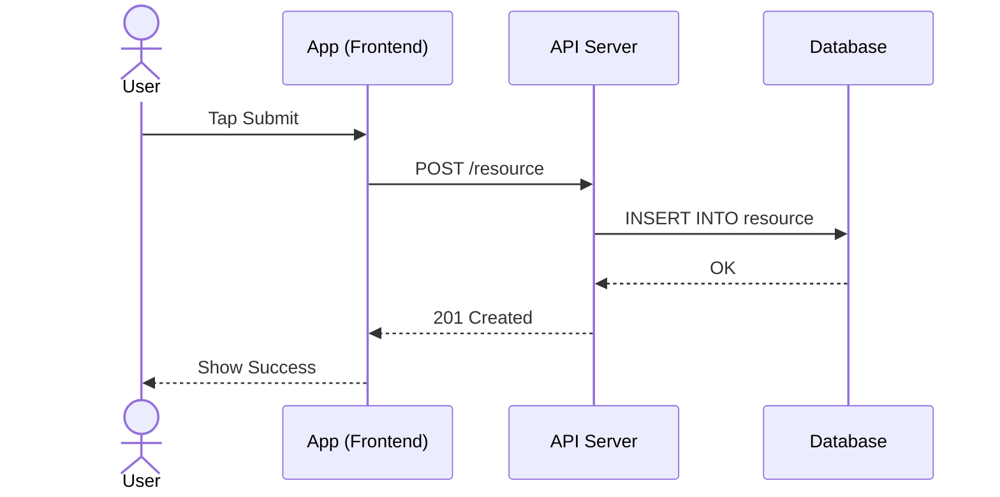
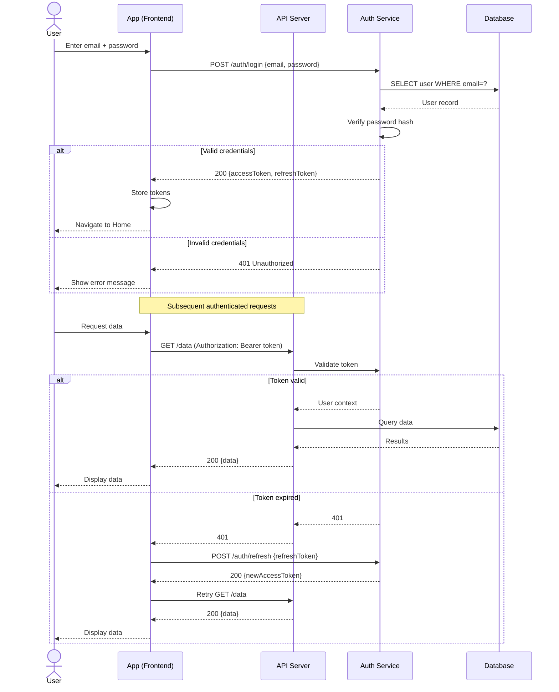
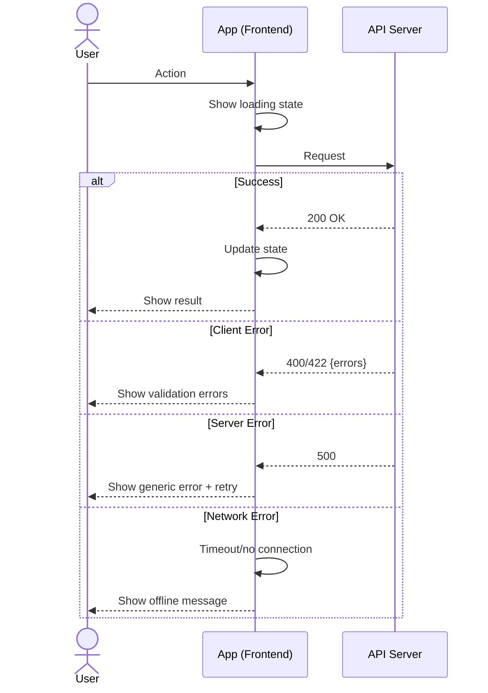

# Mermaid Diagram Patterns

Ready-to-use syntax patterns for UX flow diagrams.

## Table of Contents

- [Flowchart Patterns](#flowchart-patterns)
- [State Diagram Patterns](#state-diagram-patterns)
- [Sequence Diagram Patterns](#sequence-diagram-patterns)
- [Best Practices](#best-practices)

---

## Flowchart Patterns

### Node Shapes

Use consistent shapes across all flowcharts:

```
[Screen Name]       — Rectangle: screens/pages
{Decision?}         — Diamond: conditional branch
((Start))           — Circle: entry point
([Action])          — Stadium: user action
[[Sub-flow]]        — Subroutine: link to another diagram
>Result]            — Asymmetric: outcome/redirect
```

### Subgraphs for Screen Groups

Group related screens:



### Complete Login Flow Example



### Decision Branches



---

## State Diagram Patterns

### Basic State Transitions



### Nested States

Use nested states for complex screen behaviors:



### Parallel States

For screens with independent state regions:



### Auth Flow States Example



---

## Sequence Diagram Patterns

### Basic Request Flow



### Authenticated Request Example



### Error Handling Pattern



### Actors Reference

Standard actors for UX flow diagrams:

| Actor | Label | Use |
|-------|-------|-----|
| `actor User` | End user | Human interactions |
| `participant App` | Frontend app | Client-side logic |
| `participant API` | API Server | Backend endpoints |
| `participant Auth` | Auth Service | Authentication |
| `participant DB` | Database | Data persistence |
| `participant Cache` | Cache | Redis/in-memory |
| `participant Queue` | Queue | Async jobs |
| `participant Email` | Email Service | Notifications |

---

## Best Practices

### Diagram Size
- **Max 15-20 nodes** per diagram
- If more complex, split into sub-flows with cross-references
- Use subgraphs to group related screens (max 3-4 subgraphs)

### Splitting Complex Flows

When a flow exceeds 20 nodes:

1. Identify logical boundaries (auth, onboarding, core feature)
2. Create a high-level flow with `[[Sub-flow]]` nodes
3. Create separate detailed diagrams for each sub-flow
4. Link with a note: `See: uc-001/flow-checkout.md`

### Consistent Styling

Define `classDef` once and reuse across all diagrams:

```
classDef screen fill:#e8e8e8,stroke:#999,stroke-width:2px
classDef decision fill:#fff3cd,stroke:#ffc107,stroke-width:2px
classDef action fill:#d4edda,stroke:#28a745,stroke-width:1px
classDef error fill:#f8d7da,stroke:#dc3545,stroke-width:1px
```

### Naming Conventions
- **Screens**: PascalCase — `HomeScreen`, `LoginScreen`
- **Actions**: camelCase verbs — `submitForm`, `loadData`
- **States**: PascalCase — `Loading`, `Error`, `Success`
- **Edges**: Short labels — `Success`, `Fail`, `Tap`, `Submit`

### File Naming
- Use kebab-case: `screen-map.md`, `flow.md`, `states.md`
- Use case folders: `uc-001-registration/`, `uc-002-login/`
